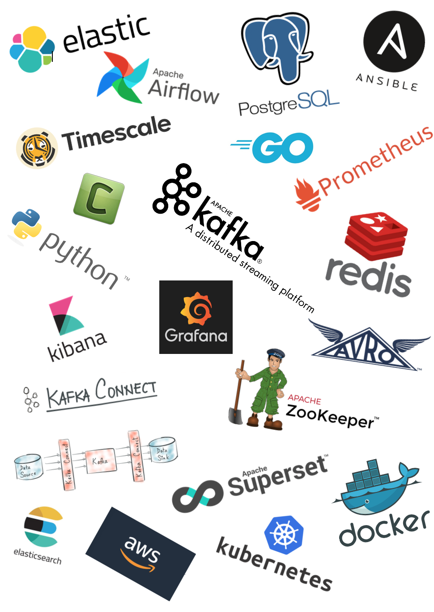

# Platform Setup
This repo contains guidelines and steps for setting up in-house production infrastructure and cloud services of open-source technologies from scratch.

## Table of Contents
Refer individual packages for detailed readme

1. CDC Pipelines:
    * [Apache Zookeeper](https://github.com/abhishektripathi24/platform-setup/tree/master/apache-zookeeper)
    * [Apache Kafka](https://github.com/abhishektripathi24/platform-setup/tree/master/apache-kafka)
    * [Confluent Inc. Kafka Connect](https://github.com/abhishektripathi24/platform-setup/tree/master/confluentinc-kafka-connect)
    * [Confluent Inc. Schema Registry](https://github.com/abhishektripathi24/platform-setup/tree/master/confluentinc-schema-registry)

2. ETL jobs and workflow management
    * [Apache Airflow](https://github.com/abhishektripathi24/platform-setup/tree/master/apache-airflow)

3. Databases
    * Relational: [PostgreSQL](https://github.com/abhishektripathi24/platform-setup/tree/master/postgres), [Timescale](https://github.com/abhishektripathi24/platform-setup/tree/master/timescale), [Mysql](https://github.com/abhishektripathi24/platform-setup/tree/master/mysql)
    * Document: [MongoDB](https://github.com/abhishektripathi24/platform-setup/tree/master/mongo)
    * Key-value: [Redis](https://github.com/abhishektripathi24/platform-setup/tree/master/redis) 
    * Graph: [Neo4j](https://github.com/abhishektripathi24/platform-setup/tree/master/neo4j)
    * Time-Series: [Prometheus](https://github.com/abhishektripathi24/platform-setup/tree/master/prometheus) (NoSQL), [Timescale](https://github.com/abhishektripathi24/platform-setup/tree/master/timescale) (SQL)

4. Search engines
    * [Elasticsearch](https://github.com/abhishektripathi24/platform-setup/tree/master/elasticsearch)
    
5. Centralized Logging
    * [Elastic Stack - Filebeat, Elasticsearch-Ingest-Pipeline, Kibana](https://github.com/abhishektripathi24/platform-setup/tree/master/elastic-stack)

6. Business Intelligence + Data Visualization
    * [Apache Superset](https://github.com/abhishektripathi24/platform-setup/tree/master/apache-superset)
    * [Grafana](https://github.com/abhishektripathi24/platform-setup/tree/master/grafana)

7. Container Orchestration
    * [Kubernetes](https://github.com/abhishektripathi24/platform-setup/tree/master/kubernetes)

8. Service Discovery, Health Checking & Configuration
    * [Consul](https://github.com/abhishektripathi24/platform-setup/tree/master/consul)

9. SSL Certs, Load balancing & Reverse Proxying
    * [Let's Encrypt](https://github.com/abhishektripathi24/platform-setup/tree/master/letsencrypt/)
    * [NGINX](https://github.com/abhishektripathi24/platform-setup/tree/master/nginx/)

10. Miscellaneous:
    * [OpenVPN](https://github.com/abhishektripathi24/platform-setup/tree/master/vpn/)
    * [Linux Utilities](https://github.com/abhishektripathi24/platform-setup/tree/master/linux/)

...

