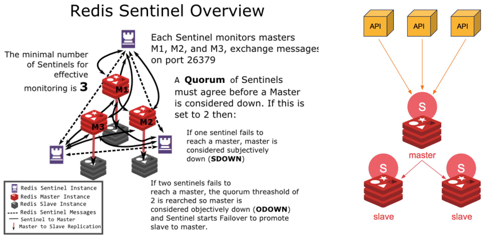

# Redis [Sentinel Setup]


To know more about Redis Sentinel, visit https://redis.io/topics/sentinel

## Overview


From the official docs -

> Redis Sentinel provides high availability for Redis. In practical terms this means that using Sentinel you can create a Redis deployment that resists without human intervention certain kinds of failures.

## Setup

1. Installation on ubuntu 18.04.3 LTS
    ```bash
    sudo apt update
    sudo apt install gcc 
    sudo apt-get install -y tcl
    wget http://download.redis.io/releases/redis-5.0.7.tar.gz
    tar xzf redis-5.0.7.tar.gz
    cd redis-5.0.7
    make distclean
    make
    make test
    ```

2. Configure OS: This will remove all the warnings in redis-server logs.
    ```bash
    # Swap space
    sudo sysctl vm.swappiness=1 # Temporary
    echo vm.swappiness=1 >> /etc/sysctl.conf # Permanent
    
    # Overcommit memory
    sudo sysctl vm.overcommit_memory=1 # Temporary
    echo vm.overcommit_memory=1 >> /etc/sysctl.conf # Permanent
 
    # somaxconn
    echo 1024 > /proc/sys/net/core/somaxconn # Temporary
    echo net.core.somaxconn=1024 >> /etc/sysctl.conf # Permanent

    # THP (disable-thp.service is available in redis/systemd in this repo or refer - https://www.stephenrlang.com/2018/01/disabling-transparent-huge-pages-in-linux/)
    echo never > /sys/kernel/mm/transparent_hugepage/enabled # Temporary
    sudo systemctl enable disable-thp.service && sudo systemctl start disable-thp.service # Permanent
    ```

3. Configure Redis-Server: update redis.conf
    * Configure Master:
        * Comment the line `bind 127.0.0.1` if you want to allow clients to connect redis from all network interfaces and not restricted to loopback interface.  
        * Disable auth by setting `protected-mode no` if you don't want authentication.
        * Set `supervised systemd`, if you want to manage redis via systemd. The systemd files for redis-server and redis-sentinel can be found under redis/systemd in this repo.
        * Set `logfile "/var/log/redis/redis-server.log"`
        * Set `stop-writes-on-bgsave-error no` to allow accept writes even if BGSAVE failed.
        * Set `dir "/data"` to allow saving data `dump.rdb` file at a volume different than root.
        * Disable critical commands. (Please add these after testing the setup. Otherwise you won't be able to issue these commands.)
            ```
            rename-command FLUSHDB ""
            rename-command FLUSHALL ""
            rename-command DEBUG ""
            ```
    * Configure Slave:
        * Repeat and add all the properties of master.
        * Set `replicaof  <masterip> <masterport>`.

4. Configure Redis-Sentinel: update sentinel.conf
    ```bash
    sentinel monitor mymaster <ip-address-of-initial-master-redis-server> 6379 2
    sentinel down-after-milliseconds mymaster 5000
    sentinel parallel-syncs mymaster 1
    sentinel failover-timeout mymaster 10000
    sentinel deny-scripts-reconfig yes
    ```
    > Note: Please do not copy sentinel.conf to other servers if you have started sentinel process even once. 
    
    > Reason: Upon starting the sentinel process, it writes a unique id for itself in the sentinel.conf (sentinel myid 1e05acbfea43ecc0ff0c976ede504805a6342db3). And if you replicate (copy-paste) this sentinel.conf to other sentinel servers, all of them will behave as if you have a single sentinel node instead of 3 nodes in the cluster, as all of them will have the same id.
    
    > Moral of the story: Each sentinel node should have unique id in the sentinel cluster and this id is generated automatically by sentinel process itself.

5. Testing the cluster setup
    * Verify that sentinels see each other. If, for ex, you are setting up 3 sentinels, the property `num-other-sentinels` should be `2` upon starting all the sentinel nodes.
    * Run following commands on any sentinel node - 
        ```bash
        cd <path/to/redis-5.0.7>/src
        ./redis-cli -p 26379
        127.0.0.1:26379> sentinel master mymaster
        33) "num-other-sentinels"
        34) "2"
        35) "quorum"
        36) "2"
        ```
    * Simulate failover-scenario -
        * Run following command on redis-master. And verify the logs of sentinel and redis-slave as they vote and switch the master.
            ```bash
            cd <path/to/redis-5.0.7>/src
            ./redis-cli -p 6379 
            127.0.0.1:6379> DEBUG sleep 30
            ```

6. Backup data from AWS ElastiCache
    * Create backup of your ElastiCache.
    * Migrate backup to S3 using aws cli -
        * Create an S3 bucket.
        * Provide permission to the bucket to receive data from elastic cache -
            * Go to Permission -> Access Control List
            * Under the section "Access for other AWS accounts" click on "Add Account"
            * Add following id to it - 540804c33a284a299d2547575ce1010f2312ef3da9b3a053c8bc45bf233e4353 (this is canonical id for singapore region. For other regions, refer [Exporting a ElastiCache Backup](https://docs.aws.amazon.com/AmazonElastiCache/latest/red-ug/backups-exporting.html))
            * Finally provide all the read-write permission to this account and click save.
        * Run following command from terminal - 
            ```bash
            aws elasticache copy-snapshot \
                --source-snapshot-name <backup-name> \
                --target-snapshot-name my-exported-backup \
                --target-bucket <s3-bucket-name>
            ```

7. Other useful references
    * [What redis deployment do you need?](https://blog.octo.com/what-redis-deployment-do-you-need/) 
    * [A medium blog may be?](https://medium.com/@amila922/redis-sentinel-high-availability-everything-you-need-to-know-from-dev-to-prod-complete-guide-deb198e70ea6)